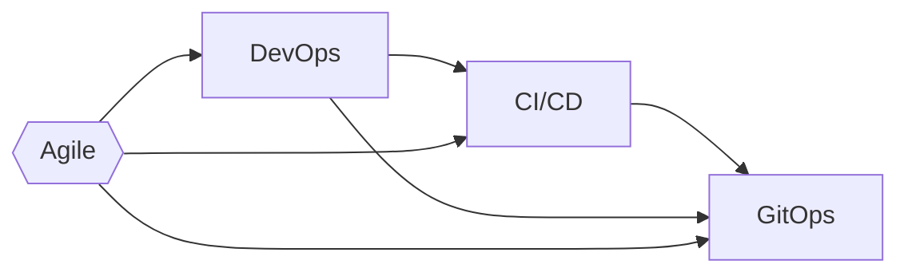

<span class="text-8xl text-white" style="font-weight:700;" >
    Git<span class="text-blend">Ops</span> <!-- <logos-git-icon /> --> <!--light-icon icon="git-pull-request"/-->
</span>
<div class="text-5xl text-primary-lighter mb-2rem" style="font-weight:500;" >
    Beyond Patterns and Principles
</div>
<div>
    Joel Bennett
</div>
<div>
    April 8-11, <span class="text-blend">2024</span>
</div>

---
layout: image-right-pop
image: https://HuddledMasses.org/assets/images/avatar.png
---

# Joel "Jaykul" Bennett

## Principal DevOps Engineer

``` text
Solving problems with code
15x Microsoft MVP for PowerShell
```

  <div class="absolute bottom-16 left-16">
    <a href="https://github.com/Jaykul"><logos-github-icon /> github.com/Jaykul</a> and <a href="https://github.com/PoshCode">PoshCode</a><br/>
    <a href="https://discord.gg/PowerShell"><logos-discord-icon /> discord.gg/PowerShell</a><br/>
    <a href="https://HuddledMasses.org"><emojione-statue-of-liberty /> HuddledMasses.org</a><br/>
    <a href="https://fosstodon.org/@Jaykul"><logos-mastodon-icon /> @Jaykul@FOSStodon.org</a><br/>
  </div>

<!--

For those of you who came to this talk despite not knowing me, thank you, and let me introduce myself.

I'm Joel Bennett, and I'm from upstate New York by way of the grasslands of Guanacaste, Costa Rica. I have been "Jaykul" (J. Cool) online since the 1990s, and I'm currently a Principal DevOps Engineer! I've been solving problems with code since the last century, and I've been recognized as a Microsoft MVP for PowerShell fifteen times in a row now. I am an open source developer, and I coordinate the official PowerShell support chat and virtual user group, so you can find me on GitHub, Discord, Mastodon, and more rarely on Slack and Twitter, and I'm always happy to chat about PowerShell, DevOps, GitOps.

-->

---
layout: section
background: https://images.unsplash.com/photo-1516670428252-df97bba108d1?ixlib=rb-4.0.3&q=85&fm=jpg&crop=entropy&cs=srgb&dl=adrien-converse-kCrrUx7US04-unsplash.jpg&w=1920
---

# What is GitOps?

<v-clicks>

## Principles for Operating and Managing Software Systems

### We are not merely building infrastructure from code

### We seek to create _systems_ that continuously update and repair themselves

</v-clicks>

<!--
So, what is GitOps? Can anyone put it in a single sentence?

The [OpenGitOps][1] project -- which is a Cloud Native Computing Foundation ([CNCF][3]) Sandbox project from the [GitOps Working Group][2] under the CNCF _App Delivery_ Technical Advisory Group (TAG), defines GitOps as

**{NEXT}** "a set of principles for operating and managing software systems."

**{NEXT}** GitOps definitely includes infrastructure as code, but it's not that simple.

**{NEXT}** GitOps is about creating systems that continuously update and repair _themselves_.

## I hope you heard me when I said that:

### GitOps principles are about _operating_ and _managing_ software systems, not _building_ them.

You can follow GitOps Principles even when you're hosting _third party_ software, and not writing your own applications, but it's not relevant if you are building software for others to run. In other words, GitOps Principles apply only to a _strict subset_ of DevOps, and GitOps is not a _replacement_ for DevOps.

I have to admit that _for software as a service_, I do think of GitOps as the next iteration on _Agile_, following _DevOps_, and _Continuous Delivery_. But those terms are so **overused** in recruiting and marketing that sometimes GitOps practitioners actually object to being associated with them, so I'm going to take _just 2 minutes_ to quickly **{NEXT}** go through the historical context before we talk about the definition of GitOps.

[1]: https://opengitops.dev/
[2]: https://github.com/cncf/tag-app-delivery/tree/main/gitops-wg
[3]: https://www.cncf.io/

-->

---
rightHeader: What is GitOps?
---

# Historical Context

<!--

-->

```mermaid {fontFamily: 'Ubuntu', gitGraph: { mainBranchName: 'Agile', showCommitLabel: false } }
gitGraph
    commit tag: "1993"
    commit
    branch DevOps
    checkout DevOps
    checkout Agile
    commit tag: "2001: Agile Manifesto"
    branch Continuous
    checkout DevOps
    commit tag: "2008"
    checkout DevOps
    checkout Continuous
    merge DevOps tag: "2010"
    checkout Agile
    commit
    checkout DevOps
    commit
    checkout Continuous
    branch GitOps
    checkout Continuous
    commit
    checkout GitOps
    commit tag: "2017"
```

<!--
I want to take _just 2 minutes_ to quickly go through the historical context before we talk further about the definition of GitOps.
-->

---
rightHeader: What is GitOps?
clicks: 3
---

# Historical Context

## Agile Software Development (2001)

The [_agile manifesto_](http://agilemanifesto.org/) prioritized collaboration and flexibility...

<v-clicks every="2" >

## DevOps (2008)

DevOps centers on cultural change, unifying Dev and Ops organizations with common goals and shared KPI.

## Continuous Delivery (or Deployment) (2010)

Continuous Delivery became a noun, with a focus on automated pipelines, and small, frequent releases.

## GitOps (2017)

GitOps is a _set of principles_ for operating and managing software systems.

</v-clicks>

<!--

Back in 2001 engineers who were doing what they called "agile software development" got together and signed the [_Agile Manifesto_][0]. There were twelve principles behind it, but the first and highest priority was to **satisfy the customer through early and _continuous delivery_ of valuable software.** The core ideas of Agile were about _people_ and their attitudes, and how we manage them in projects: let them self-organize, welcome change, reflect on the results, _adapt_ your processes. The agile manifesto focused on people, and how they _collaborate_, and _communicate_.

**{NEXT}** However, as developers sought _agility_ through _continuous delivery_, they began to feel that traditional operations teams and frameworks (like [ITIL][1]) **were** the bottleneck. Thus was born the [DevOps movement][2], which was all about the _cultural change_ necessary to _unify_ software development (Dev) and operation (Ops) organizations. Adopting DevOps meant finding common goals and principles between those two groups, and establishing shared performance indicators so they wouldn't be working at cross-purposes.

**{NEXT}** Meanwhile, teams that had not hit bottlenecks started talking more about "Continuous Delivery." They created integrated teams, with developers, testers, and operations engineers together, and focused on increasing the reliability and frequency with which they could build, test, and release software. They found some success by mostly treating _people problems_ as tangential, and focusing on the technical processes required: **automated** build, test, and deployment. Ultimately they began to show success at reducing both _cost_ and _risk_ by enabling small, incremental changes, released frequently. In 2014, Dr. Dobbs magazine actually called Continuous Delivery "The Agile Successor."

**{NEXT}** So that's the backdrop. GitOps principles are derived from modern software operations and they are rooted in these pre-existing and widely adopted best practices. The new term "GitOps" was coined by Weaveworks CEO Alexis Richardson in a blog post in 2017, and through the CNCF (Cloud Native Computing Foundation), it quickly became a term of art which they have worked to define and promote. So maybe what you really wanted to know is: what are these GitOps principles?

[0]: http://agilemanifesto.org/
[1]: https://www.ibm.com/topics/it-infrastructure-library
[2]: https://www.atlassian.com/devops/what-is-devops/history-of-devops
-->

---
rightHeader: What is GitOps?
layout: two-cols
layoutClass: open-gitops
leftClass: col-span-4
rightClass: col-span-8
---

::left::

# GitOps

## Principles

### v1.0.0 {.pl-3}

::right::

### Declarative {.before:content-['1']}

<v-click at="1" >

A _system_ managed by GitOps must have its desired state expressed _declaratively_.

</v-click>

### Versioned and Immutable {.before:content-['2']}

<v-click at="1" >

Desired state is _stored_ in a way that enforces immutability, versioning and retains a complete version history.

</v-click>

### Pulled Automatically {.before:content-['3']}

<v-click at="1" >

Software agents automatically pull the desired state declarations from the source.

</v-click>

### Continuously Reconciled {.before:content-['4']}

<v-click at="1" >

Software agents _continuously_ observe actual system state and _attempt to apply_ the desired state.

</v-click>

<!--
So (according to the GitOps Working Group) ...

The desired state of a GitOps managed system must be: ...

Actually, take a minute to read this yourselves.

**{NEXT}**

Apart from a glossary, this is the entirety of what the Cloud Native Computing Foundation working group has been able to agree on about GitOps.

**{PAUSE}**

As you can see, GitOps does not focus on collaboration, nor on people or organization. It's simply _practical principles_ for managing software systems: how should we express and store the desired state, and how do we ensure that the system _remains_ in that state.

### Let's dig into it a little more.
-->

---
layout: image-right
rightHeader: What is GitOps?
image: /images/turtles-all-the-way-down.jpg
bleed: true
---

# Declarative

The code for the desired state is _independent_ of the steps needed to get there.

<v-click>

# Versioned and immutable

## It's code all the way down

1. The software _source_ is code
2. The infrastructure _source_ is code
3. The configuration _source_ is code
4. _All **source** code is version controlled_

</v-click>

<!--
What does it mean that our desired state is _declarative_?:

In programming, we talk about Imperative code, which describes a set of steps to be taken to achieve a goal, and about Declarative code, which simply describes the goal itself.

The Desired State of systems always needs to be written _declaratively_,
expressing _how things should be_, without regard for _how they currently are_,
because there are too many possible actual states.
We succinctly describe our desired state, and rely on an agents or operator to analyze the current state and determine the specific steps to be taken...

**{NEXT}**

I tend to think that versioning your state declaration is so obvious at this point that it goes without saying, but some people need every detail spelled out, and others will _deliberately_ flaunt anything that's not in writing. For the record:

1. Developers have been tracking changes to their source code for decades
2. Of course, you know you should declare your infrastructure as (source) code
3. Please believe that you need to treat your configuration as source code too
4. And obviously, you need to store _all code_ in your version control system

It does _not_ have to be git. In fact, you should probably just use whatever your developers already use.

The requirement here is that you have versions of your desired state that are immutable, and you can revert, and thus (re)deploy an old version.

-->

---
layout: image-right
rightHeader: What is GitOps?
image: /images/robotic-agents.jpg
bleed: true
---

# Pulled Automatically

GitOps uses **software agents** that **pull** the desired state from source. This scales well, and only requires _read_ access to source.

<v-click>

# Continuously Reconciled

**Reconciliation** is the process of ensuring the _actual state_ matches the _desired state_. It's triggered _whenever_ there is a divergence -- whether a new version of the desired state, or drift in the actual state.

</v-click>
<v-click>

## Continuous Deployment is great

### But please don't conflate

</v-click>

<!--

The key thing that **distinguishes** GitOps are _software agents_ that automatically pull the desired state from source and _continuously_ attempt to apply it through a process known as **{{NEXT}}** reconciliation.

Reconciliation is _**not** just_ triggered by commits to source control. GitOps includes continuous monitoring and repairing. It's not just about _deploying_ when there's a new versions, it's about _monitoring_ the system, and keeping it in the desired state.

GitOps is deliberately defined so it can expand to control all of the _desired state_ of systems -- not just the infrastructure are code, or which version of the software, or the configuration, but also what the _performance_ and _availability_ of the system _should be_.

**{{NEXT}}**

#### Now. You _will_ see people talking about "push GitOps" ...

_Here's my two cents:_ People who downplay the "pull" are usually also downplaying the "agents" and most often they are trying to coopt the term "GitOps" to describe _whatever product they were already selling_ for continuous deployment. That's not useful.

We love Continuous deployment.

**{{NEXT}}**

But let's not confuse things. Using pipelines to trigger Continuous Deployment on merge to main is not GitOps. It's Continuous Deployment.


-->

---
layout: default
rightHeader: What is GitOps?
---

# GitOps wants to be more

<v-clicks>

## Conceptually different

> GitOps follows [control theory](https://en.wikipedia.org/wiki/Control_theory) and operates in a closed-loop, where feedback represents how previous attempts to apply a desired state have affected the actual state. Actions are taken based on policies, it order to _reduce deviation_ over time.

- ### Is the Octopus Deploy Agent a GitOps agent?
- ### Is Windows Desired State Configuration (DSC) a GitOps agent?

</v-clicks>

<!--
GitOps is more than Continuous Deployment. But also, GitOps _wants_ to be more than it currently is...

**{{NEXT}}**

There is a _conceptual_ difference, because as I said before,
the core of GitOps are these automated agents,
and they monitor the current state,
in addition to polling for new versions.

But it's more than that. Although they failed to capture this in the four principles, Open GitOps explains in their glossary that ...
**{{NEXT}}**

GitOps is based on control-theory, a field of engineering and applied mathematics that develops systems like cruise control and thermostats.
This means that Agents should work to drive the system to it's desired state while minimizing delay, overshoot, and steady-state errors, ensuring stability and optimality.

In other words, although a _minimum_ implementation today might just:
- automatically destroy deviating cattle servers (or containers) and
- deploy new infrastructure (or containers) based on the template, and then
- deploy the correct version of the software, and finally
- set the configuration to the current values ...

The goal is for agents to make smaller changes to move the system _toward_ the desired state.
They should be _feedback_ driven, and _policy_ driven, and they should _reduce deviation_ over time.

**{{NEXT}}**
Here are a couple of questions for you:
- Is the Octopus Deploy Agent (or the Azure Pipelines agent) a GitOps agent?
- Is Windows Desired State Configuration (DSC) a GitOps agent?

The Octopus Deploy Agent and the Azure Pipelines Agent are _push_ agents, and they just waits for jobs to be pushed to them. They do not monitor anything.

On the other hand, DSC (or the LCM, specifically), has versioned and declarative desired state, which it pulls automatically, and continuously reconciles. It's not a perfect match, because it doesn't actually have multiple versions in the source... but it's very close. At work we've built a system where we manage our desired state as json files, and "build" MOF files (and publish to the Pull server) on commit to main. Each of our servers has the LCM configured in pull mode to continuously monitor and pull new versions....

The **desired state** can include specific measurable results (like performance indicators, response time, etc.) and Agents should work to drive the system to it's desired state while minimizing delay and overshoot to achieve stability and optimality. In an ideal system, agents would automatically find the balancing point between conflicting goals, but we're not there yet.

One point to mention here: at this stage, it doesn't really matter _how_ this is achieved. WHether it's event-based monitoring of actual state changes, or polling the state over and over again. Whether the agent runs in the hosting environment, or connects to it remotely. Whether it pulls the desired state directly from git, or there's a pipeline that moves code from source control to a "current version" artifact.

As I said about Infrastructure as Code, there are many tools here, and we've clearly not reached peak GitOps -- picking agents right now comes down to making the right trade-offs for your systems -- you will probably need to combine and layer several of these tools to get where you want to be.

-->

---
layout: section
contentClass: grid grid-cols-2 gap-1em
background: https://images.unsplash.com/photo-1516670428252-df97bba108d1?ixlib=rb-4.0.3&q=85&fm=jpg&crop=entropy&cs=srgb&dl=adrien-converse-kCrrUx7US04-unsplash.jpg&w=1920
---

<div class="col-span-2">

# Best Practices

Or, how do I GitOps?

</div>

## Standardization

## Twelve-Factor Apps

## Change Management

<!--

We **definitely** don't have time for a full deep dive into best practices, but I want to touch on a few things that I think are most useful to people who are just getting starting with GitOps Principles, so let's spend a few minutes talking about these.

Remember, GitOps basically assumes you're already doing DevOps. That you have a culture of collaboration and shared goals and responsibility, with a focus on automation and repeatability.
-->


---
rightHeader: Best Practices
---

# Standardization


In short, you can't control a train or a ship with the autopilot for a Tesla.

<v-click>

## Especially with micro-services

### Automation requires standardization

### Reduce variations and alternatives

### Avoid custom one-off implementations

</v-click>


<!--

Let's talk about this as control theory. Let's say you're building a thermostat or a cruise control. Imagine I built an auto pilot for a sports car, and then tried to use it to control my fleet of tractor trailers. Or Imagine we built a thermostat for forced-air industrial HVAC systems in gyms. Are we going to be able to use that to control the heat in an multi-floor apartment building that uses steam radiators?  No. You'll overheat the apartments every time, and flip back and forth between too hot and too cold, and broil the upstairs and freeze the downstairs.

The biggest _improvements_ from following GitOps Principles come when you're managing systems that are made up of many small services, where those services are all built with the same technologies and frameworks, are packaged and deployed the same way, have similar configuration, monitoring, and management options, and even have similar density and scale requirements.

None of this is to say you can't have different classes of systems, just that each time you have something that's different it will cause friction and extra work.

For each type of system, all the teams that interact with it need to build custom knowledge and understanding, and in the worst case, unique, one-off agents or agent configurations.

-->

---
rightHeader: Best Practices
---

# Standardization

<div class="columns grid grid-auto-flow-col gap-1em grid-rows-1">

<div>

### Start small

<v-click>

- Source control
- Pull requests
- Continuous **Delivery**
- Automate Deployments
- Health checks

</v-click>
</div><div>

### Best of breed tools

<v-click>

- Code-based
- Declarative
- Idempotent


</v-click>
</div><div>

### Dependency management

<v-click>

- Vulnerability scanning
- Prevent stale
- Included in Health Checks
- Included in Auto Scaling

</v-click>
</div>
</div>

<!--

To minimize the cost of managing systems with software agents, we need to standardize _everything_ that we can. Beyond how we build and deploy the software, to how we manage dependencies, how services are configured, how they scale (and how we know they need to scale). We increase our ability to change quickly by standardizing as much as possible.

**{NEXT}**

Don't assume that what works for others will work for you.
- Start small, with a single project, and make sure you have the basics in place:
- If you don't have source control, start with that.
- If you don't use pull requests, start with that.
- If you don't have automatic builds that deliver versioned packages, start with that.
- If you don't have automated deployments, start with that.
- If you don't have health checks, add those.

**{NEXT}**

As you identify your next steps, evaluate and choose tools.
Try to always **PICK THE _BEST_ TOOLS** so you won't be tempted to switch, and won't need to let people use alternatives. Use the same tools across all of your projects. This is not to say you'll never re-evaluate and choose new tools, but avoid having multiple options you need to build separate control systems for.

When you're picking tools, keep those two words in mind: declarative and idempotent. Remember:
- Infrastructure and Configuration code should be declarative, separating the desired state from the steps needed get there.
- The automation that builds infrastructure, or applies configuration should be idempotent, so that it can be run repeatedly without causing harm.
  If you can't find idempotent tools, this might be worth the custom development to wrap your tools in check scripts to make them idempotent.

**{NEXT}**

Finally, make sure you have a good dependency management system.
This isn't just about libraries, it's also about service-to-service dependencies.
Make sure you know where your dependencies are, that you have health checks and scaling in place.

How do you track dependencies. I don't mean just binaries you need at build time, but which services depend on others. Your health checks should make this obvious, since they should test the upstream services. Do they scale together? Do your service's dependencies scale (up, and down) fast enough when the front line service scale?
 -->

---
layoutClass: columns grid-rows-5
rightHeader: Best Practices
---
<div class="col-span-3">

# The Twelve-Factor App ([12factor.net](https://12factor.net/))

</div>

<!-- <v-clicks> -->

<div>

### I. Codebase

One codebase tracked in revision control, many deploys

</div><div>

### II. Dependencies

Explicitly declare and isolate dependencies

</div><div>

### III. Config

Store config in the environment

</div><div>

### IV. Backing services

Treat backing services as attached resources

</div><div>

### V. Build, release, run

Strictly separate build and run stages

</div><div>

### VI. Processes

Execute the app as one or more stateless processes

</div><div>

### VII. Port binding

Export services via port binding

</div><div>

### VIII. Concurrency

Scale out via the process model

</div><div>

### IX. Disposability

Maximize robustness with fast startup and graceful shutdown

</div><div>

### X. Dev/prod parity

Keep development, staging, and production as similar as possible

</div><div>

### XI. Logs

Treat logs as event streams

</div><div>

### XII. Admin processes

Run admin/management tasks as one-off processes

</div>

<!--

My personal favorite example of standardization is the Twelve-Factor app!

These factors are a methodology for writing software that works well in software as a service environments. 12 Factor Apps are designed to be _declarative_, _portable_, _scalable_, and _concurrent_. Following these factors tends to make it so that the operation of the apps doesn't even depend on the language or framework used to build them.

I actually consider two of these "factors" to be required for GitOps, regardless of your hosting environment.

But if you're doing GitOps with microservices, and especially on Kubernetes, I consider almost all of them to be mandatory.

I think this is also a great example of why GitOps isn't something the Ops or "DevOps" teams can pull off on their own. Obviously, you need developers, software architects, and engineering teams to all agree on these sorts of standards.

-->

---
layout: two-cols
rightHeader: Best Practices
---

::header::

# Change Management

::left::

<v-click>

## Separate Repositories

Infrastructure != Application != Configuration

- Independent life-cycles
- Separate approval processes
- Different team ownership

</v-click>

::right::

<v-click>

## Environment Configuration

Don't use mono-repos or branch-per-environment

- Create versioned configuration artifacts
- Import artifacts, or inherit a shared base
- Use overlays for different environments
- Think about versioning and promotion of the base

</v-click>

<!--
I'm not a big fan of mono-repos in general, but for GitOps we have a few special reasons for separating our infrastructure, apps, and configuration repositories.

- The primary reason is to keep the versioning separate, and avoid triggering CI/CD pipelines for config or infrastructure changes. You don’t want a simple configuration change (like scaling a deployment from three to four replicas) to trigger a CI/CD rebuild and test of your application (especially not if that's required prior to being able to merge the change).
- You also don't want to hold up CI/CD builds with the change management approvals you might need for infrastructure changes, and one of the nice things about using git for infrastructure and configuration is that we can use git's built-in features for approvals and change tracking.
- You may have different teams responsible for infrastructure and application code or configuration, and different code-review or approval processes for code versus infrastructure or configuration.

You could, hypothetically, put a bunch of path filters on your triggers and validation rules, etc., but that adds unnecessary complications and potential for error.

**{NEXT}**

**HOWEVER**.Given what I just said, this may seem to go against the grain, but although you might be tempted to try to have separate branches per environment, or even separate repositories per environment, most of us with experience _doing_ this are advising against that, because

- Promoting from one environment to another is usually not as simple as a merge
- There is much that cannot be promoted from one environment to another: configuration, secrets, scale, etc.

Regardless of what tools you're actually using and what your hosting environment is, consider the layout used for Kustomize and Helm, where you have a "base" directory and then an overlay directory for each environment...


Make sure you consider how to protect your _production_ environment from changes that you are testing in _staging_ or _development_ environments.

-->