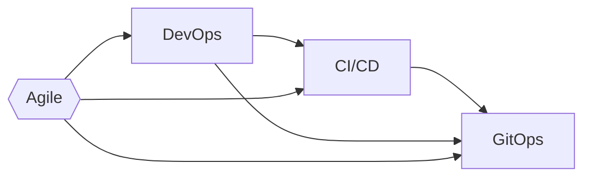

<span class="text-8xl text-white" style="font-weight:700;" >
    Git<span class="text-blend">Ops</span> <!-- <logos-git-icon /> --> <!--light-icon icon="git-pull-request"/-->
</span>
<div class="text-5xl text-primary-lighter mb-2rem" style="font-weight:500;" >
    Beyond Patterns and Principles
</div>
<div>
    Joel Bennett
</div>
<div>
    April 8-11, <span class="text-blend">2024</span>
</div>

---
layout: image-right-pop
image: https://HuddledMasses.org/assets/images/avatar.png
---

# Joel "Jaykul" Bennett

## Principal DevOps Engineer

``` text
Solving problems with code
15x Microsoft MVP for PowerShell
```

  <div class="absolute bottom-16 left-16">
    <a href="https://fosstodon.org/@Jaykul"><!-- <logos-mastodon-icon /> --> @Jaykul@FOSStodon.org</a><br/>
    <a href="https://github.com/Jaykul"><!-- <logos-github-icon /> --> github.com/Jaykul</a><br/>
    <a href="https://HuddledMasses.org"><!-- <emojione-v1-statue-of-liberty /> --> HuddledMasses.org</a><br/>
  </div>

<!--

For those of you who came to this talk despite not knowing me, thank you, and let me introduce myself. I'm Joel Bennett, I'm from upstate New York by way of the grasslands of Guanacaste, Costa Rica. I have been "Jaykul" (pronounced J. Cool) online since the 1990s, and I'm currently the Principal DevOps Engineer at loanDepot! I've been a Microsoft PowerShell MVP for 15 years, an open source programmer for over 25 years, a Christian for uhm, let's go with "over 40 years," and bilingual for even longer than that.

-->

---
layout: section
background: https://images.unsplash.com/photo-1516670428252-df97bba108d1?ixlib=rb-4.0.3&q=85&fm=jpg&crop=entropy&cs=srgb&dl=adrien-converse-kCrrUx7US04-unsplash.jpg&w=1920
---

# What is GitOps?

<v-clicks>

## Principles for Operating and Managing Software Systems

### We are not merely building infrastructure from code

### We seek to create _systems_ that continuously update and repair themselves

</v-clicks>

<!--
So, what is GitOps? Can anyone put it in a single sentence?

THe [OpenGitOps](https://opengitops.dev/) project -- which is a CNCF Sandbox project from the [GitOps Working Group](https://github.com/cncf/tag-app-delivery/tree/main/gitops-wg) under the CNCF App Delivery TAG) defines GitOps as ((CLICK)) "a set of principles for operating and managing software systems."

((CLICK)) It definitely includes infrastructure as code, but it's not that simple.

((CLICK)) GitOps seeks to create systems that continuously update and repair themselves.

I hope you'll hear me when I say this is about _operating_ and _managing_ software systems, not _building_ them. You can follow GitOps Principles even when you're hosting _third party_ software, but it's not relevant if you're building software for others to run. As a result, GitOps is strictly a _subset_ of DevOps, not a _replacement_ for DevOps.

I have to say that I think of GitOps as just the next iteration on _Agile_, following _DevOps_, and _Continuous Delivery_. But those terms are so **overused** in recruiting and marketing that sometimes GitOps practitioners actually object to being associated with them, so I'm going to take _just 2 minutes_ to quickly go through the ((CLICK)) historical context before we talk about the definition of GitOps.
-->

---
rightHeader: What is GitOps?
---

# Historical Context

<!--

-->

```mermaid {fontFamily: 'Ubuntu', gitGraph: { mainBranchName: 'Agile', showCommitLabel: false } }
gitGraph
    commit tag: "1993"
    commit
    branch DevOps
    checkout DevOps
    checkout Agile
    commit tag: "2001: Agile Manifesto"
    branch Continuous
    checkout DevOps
    commit tag: "2008"
    checkout DevOps
    checkout Continuous
    merge DevOps tag: "2010"
    checkout Agile
    commit
    checkout DevOps
    commit
    checkout Continuous
    branch GitOps
    checkout Continuous
    commit
    checkout GitOps
    commit tag: "2017"
```

<!--
... go through the historical context before we talk about the definition of GitOps.
-->

---
rightHeader: What is GitOps?
clicks: 3
---

# Historical Context

## Agile Software Development (2001)

The [_agile manifesto_](http://agilemanifesto.org/) prioritized collaboration and flexibility...

<v-clicks every="2" >

## DevOps (2008)

DevOps centers on cultural change, unifying Dev and Ops organizations with common goals and shared KPI.

## Continuous Delivery (or Deployment) (2010)

Continuous Delivery became a noun, with a focus on automated pipelines, and small, frequent releases.

## GitOps (2017)

GitOps is a _set of principles_ for operating and managing software systems.

</v-clicks>

<!--

There were twelve principles behind the Agile Manifesto, but the first and highest priority was to "satisfy the customer through early and _continuous delivery_ of valuable software." The core ideas were about _people_ and their attitudes, and how we manage them in projects: to let them self-organize, to welcome change, to reflect on the results, to adapt your processes frequently, and to focus on _collaboration_, and _communication_.

However, as developers sought _agility_ through _continuous delivery_, they began to feel that traditional operations teams and frameworks (like [ITIL](https://www.ibm.com/topics/it-infrastructure-library)) were the bottleneck. Thus was born the [DevOps movement](https://www.atlassian.com/devops/what-is-devops/history-of-devops), which was all about the _cultural change_ necessary to _unify_ software development (Dev) and operation (Ops) organizations. Adopting DevOps meant finding common goals and shared principles between those groups, and establishing shared performance indicators so they wouldn't be working at cross-purposes.

Meanwhile, teams that had not hit bottlenecks started talking about "Continuous Delivery" and created integrated teams, with developers, testers, and operations engineers focusing on increasing the reliability and frequency with which they can build, test, and release software. They found some success by mostly treating _people problems_ as tangential, and focusing on the technical processes required: automated build, test, and software deployment. Ultimately they began to show success at reducing both _cost_ and _risk_ by enabling small, incremental changes, released frequently. In 2014, Dr. Dobbs magazine declared Continuous Delivery "The Agile Successor."

And this brings us to GitOps -- the GitOps principles are derived from modern software operations and rooted in these pre-existing and widely adopted best practices. The new term GitOps was coined by Weaveworks CEO Alexis Richardson, and through the CNCF (Cloud Native Computing Foundation), quickly became a term of art which they have worked to define and promote.

-->

---
rightHeader: What is GitOps?
layout: two-cols
layoutClass: open-gitops
leftClass: col-span-4
rightClass: col-span-8
---

# GitOps

## Principles

### v1.0.0 {.pl-3}

::right::

### Declarative {.before:content-['1']}

<v-click at="1" >

A _system_ managed by GitOps must have its desired state expressed _declaratively_.

</v-click>

### Versioned and Immutable {.before:content-['2']}

<v-click at="1" >

Desired state is _stored_ in a way that enforces immutability, versioning and retains a complete version history.

</v-click>

### Pulled Automatically {.before:content-['3']}

<v-click at="1" >

Software agents automatically pull the desired state declarations from the source.

</v-click>

### Continuously Reconciled {.before:content-['4']}

<v-click at="1" >

Software agents _continuously_ observe actual system state and _attempt to apply_ the desired state.

</v-click>

<!--
The desired state of a GitOps managed system must be: ...

[[HIT SPACE]]

Actually, take a minute to read this yourself. This is the entirety of what the Cloud Native Computing Foundation wrote about GitOps.

As you can see, GitOps does not focus on collaboration, people or organizations. It's simply, practical principles for managing software systems: how we express the desired state, and how we ensure that the system _remains_ in that state.
-->

---
rightHeader: What is GitOps?
layout: image-right
image: /images/turtles-all-the-way-down.jpg
bleed: true
---

# Declarative and Versioned

<v-click>

**Declarative** means the code for the desired state is _independent_ of the steps needed to get there.

</v-click>
<v-click>

**Versioned and immutable.** Because desired state is source code...

## It's code all the way down

1. The software _source_ is code
2. The configuration _source_ is code
3. The infrastructure _source_ is code
4. _All **source** code is version controlled_

</v-click>

<v-click>

IaC systems abound: Terraform, Ansible, Bicep, DSC, Kubernetes, …

</v-click>

<!--
Declarative:

One of the reasons I've started talking about "GitOps" (outside of Kubernetes) is that I started being frustrated at people using "infrastructure as code" to describe systems like Packer and Docker, which create an _initial_ configuration through imperative scripting, and _pretending_ that IaC is just a literal description, and anything that meets the definition of "code" is good enough.

GitOps reminds us that Desired State must be declarative code, expressing _how things should be_, without regard for _how they are_. We aim to separate the imperative steps to be taken to get there from our description of the desired state.

Versioned and immutable:

I tend to think that versioning your state is so obvious at this point that it goes without saying, but some people need every detail spelled out, and others will _deliberately_ flaunt anything that's not in writing. For the record:

1. Developers have been tracking changes to their source code for decades
2. Now you know you should declare your infrastructure as (source) code
3. Please believe that you need to treat your configuration as source code (version it with everything else)
4. And obviously, you need to store _all of this_ in your version control system

It does _not_ have to be git. You should probably use whatever your developers use.
The bottom line is that you have versions (or tags) that are immutable, and you can revert, and thus, (re)deploy an old version.

There are many systems and frameworks for Infrastructure as Code, and picking one comes down to making the right trade-offs for your systems. It could be Terraform or Bicep describing cloud resources, Ansible or DSC describing on-premises servers, Yaml describing Kubernetes resources, but most likely, it's a combination of all of the above, or many others.

Remember not to get carried away about _declarative_ code -- all of these frameworks have imperative code under the covers in the "resources" and the tools themselves, we are only concerned with keeping the desired state separate from the steps required to get there, so that we can ...

-->

---
layout: default
rightHeader: What is GitOps?
---

# Continuously Updated and Reconciled

<v-click>

GitOps depends on **software agents** that _automatically_ update and _continuously reconcile_ desired state.

</v-click><v-click>

**Reconciliation** is the process of ensuring the _actual state_ matches the _desired state_.

This is not simple CI/CD, with pre-set triggers.

Reconciliation is triggered _whenever_ there is a divergence -- whether that is a new version of the desired state, or drift in the actual state.

</v-click><v-click>

> GitOps follows [control theory](https://en.wikipedia.org/wiki/Control_theory) and operates in a closed-loop, where feedback represents how previous attempts to apply a desired state have affected the actual state. Actions are taken based on policies, it order to _reduce deviation_ over time.

</v-click><v-click>

Desired State systems abound too: DSC, Puppet, Chef, Ansible, Flux, ArgoCD

</v-click>

<!--

The thing that **makes** GitOps  are the _software agents_ that automatically pull the desired state from source and continuously attempt to apply it. In my mind, this is the BIG difference between "infrastructure as code" plus "continuous deployment" and GitOps.

Reconciliation is _**not** just_ deploying repeatedly, and it's not just triggered by commits to source control. GitOps including continuously monitoring and repairing.

In fact, although they failed to capture this in the four principles, Open GitOps explains in the glossary that ...

GitOps is based on control-theory, a field of engineering and applied mathematics that develops systems like cruise control and thermostats. In other words, a minimum implementation might just:
- automatically destroy deviating cattle servers and
- deploy new infrastructure to match a template, then
- deploy the correct version of the software, and
- set the configuration;

But the **desired state** could include specific  measurable results (performance, downtime, etc.) and Agents should work to drive the system to it's desired state while minimizing delay, overshoot, and steady-state errors, ensuring stability and optimality.

One point to mention here: it doesn't really matter _how_ this is achieved. WHether it's event-based monitoring of actual state changes, or polling the state over and over again. Whether the agent pulls directly from git, or there's a pipeline that moves code from source control to effective application. For those of you familiar with the old Windows PowerShell DSC, a trivial GitOps agent might just be the old LCM in pull and repair mode, configured with short intervals...

As I said about Infrastructure as Code, there are many tools here, and we've clearly not reached peak GitOps -- picking agents right now comes down to making the right trade-offs for your systems -- you will probably need to combine several of these tools to get where you want to be.

-->

---
layout: section
contentClass: grid grid-cols-2 gap-1em
background: https://images.unsplash.com/photo-1516670428252-df97bba108d1?ixlib=rb-4.0.3&q=85&fm=jpg&crop=entropy&cs=srgb&dl=adrien-converse-kCrrUx7US04-unsplash.jpg&w=1920
---

<div class="col-span-2">

# Best Practices

Or, how do I GitOps?

</div>

<v-clicks>

## Standardization

## Twelve-Factor Apps

## Change Management

</v-clicks>

<!--

We **definitely** don't have time for a full deep dive into best practices, but I want to touch on a few things that I think are most useful to people who are just getting starting with GitOps Principles.

A great example of this is the Twelve-Factor app, a methodology for writing software that works well in software as a service environments. 12 Factor Apps are designed to be _declarative_, _portable_, _scalable_, and _concurrent_. I only consider two of the "factors" in this methodology to actually be a _requirement_ for GitOps. I also believe these practices are important regardless of your hosting environment. If you're doing GitOps on Kubernetes, I almost consider them all to be mandatory. Have your developers and architecture check 12Factor.net and get agreement on standardizing as much of this as possible in your development organization.

Finally, change-management.

As I said before: you don't _have_ to use Git, but you should use the same source control systems and branching strategies across your organization. You need to have clear processes for how changes are proposed, reviewed, and deployed. When all of your changes are done through code, the merge request process in your favorite source control server becomes an easy place to build change-management processes. You can enforce policies and sign-off, require reviews by operators, enforce automated testing, etc. You can use builds and policies to enforce your processes across your organization.

You should have a clear process for how changes are rolled back, and how they are audited. You should have a clear process for how changes are tested, and how they are monitored. You should have a clear process for how changes are communicated, and how they are documented. You should have a clear process for how changes are planned, and how they are prioritized. You should have a clear process for how changes are tracked, and how they are reported. You should have a clear process for how changes are managed, and how they are measured.

-->

---
rightHeader: Best Practices
---

# Standardization

<div class="columns grid grid-auto-flow-col gap-1em grid-rows-1">

<div>

### Start small

<v-click>

- Source control
- Pull requests
- Continuous **Delivery**
- Automate Deployments
- Health checks

</v-click>
</div><div>

### Best of breed tools

<v-click>

- Code-based
- Declarative
- Idempotent


</v-click>
</div><div>

### Dependency management

<v-click>

- Vulnerability scanning
- Prevent stale
- Included in Health Checks
- Included in Auto Scaling

</v-click>
</div>


</div>

<!--

GitOps basically assumes you're already doing DevOps. Build a culture of collaboration and shared goals, with a focus on automation and repeatability. Automate your health checks, and build have a culture of continuous improvement and shared responsibility.

GitOps at scale requires standardization.

Let's talk about this as control theory. Let's say you're building a thermostat or a cruise control. Imagine we built a thermostat for forced air system and then tried to use that to control a steam radiator. You'll overheat the house, and actually flail back and forth between too hot and too cold.

To minimize the cost of managing systems with software agents, we need to standardize _everything_ that we can. Beyond how we build and deploy the software, to how we manage dependencies, how services are configured, how they scales (and how we know they need to scale). We increase our ability to change quickly by standardizing as much as possible.

### STEP

Don't assume that what works for others will work for you.
- Start small, with a single project.
- If you don't have source control, start with that.
- If you don't use pull requests, start with that.
- If you don't have automatic builds that deliver versioned packages, start with that.
- If you don't have automated deployments, start with that.
- If you don't have health checks, add those.

### STEP

As you identify your next steps, evaluate and choose tools.
Try to always **PICK THE BEST TOOLS**. Remember this is about standardization.
- We don't want to be tempted to switch later
- We don't want teams to have reasons people to use alternatives

Use the same tools across all your projects until that tool is so far behind you can't justify it anymore.
Don't be afraid to re-evaluate and choose better tools, but try to always migrate _everything_ when you migrate.

When you're picking tools, keep those two words in mind: declarative and idempotent.
- Infrastructure and configuration should be declarative whenever possible.
  If you can't find declarative tools, try to build your automation scripts as declarative tools!
- The automation that applies the configuration should be idempotent, so that it can be run repeatedly without causing harm.
  Again, if you can't find idempotent tools, wrap the tools in scripts to make them idempotent.

### STEP

Finally, make sure you have a good dependency management system.
This isn't just about libraries, it's also about service-to-service dependencies.
Make sure you know where your dependencies are, that you have health checks and scaling in place.

-->

##
---
layoutClass: columns grid-rows-5
rightHeader: Best Practices
---
<div class="col-span-3">

# Twelve-Factor Apps

</div>

<!-- <v-clicks> -->

<div>

### I. Codebase

One codebase tracked in revision control, many deploys

</div><div>

### II. Dependencies

Explicitly declare and isolate dependencies

</div><div>

### III. Config

Store config in the environment

</div><div>

### IV. Backing services

Treat backing services as attached resources

</div><div>

### V. Build, release, run

Strictly separate build and run stages

</div><div>

### VI. Processes

Execute the app as one or more stateless processes

</div><div>

### VII. Port binding

Export services via port binding

</div><div>

### VIII. Concurrency

Scale out via the process model

</div><div>

### IX. Disposability

Maximize robustness with fast startup and graceful shutdown

</div><div>

### X. Dev/prod parity

Keep development, staging, and production as similar as possible

</div><div>

### XI. Logs

Treat logs as event streams

</div><div>

### XII. Admin processes

Run admin/management tasks as one-off processes

</div>

<!-- </v-clicks> -->

---
class: grid-cols-12
rightHeader: Best Practices
---

# Change Management

<div class="leftColumn col-span-6">

<v-clicks>

## Separate Repositories

Don't mix infrastructure, application and configuration

- Independent life-cycles
- Separate approval processes
- Different team ownership

</v-clicks>

</div><div class="rightColumn col-span-6">

<v-clicks>

## Environment Considerations

- Create versioned configuration artifacts
- Import artifacts, or inherit a shared base
- Use overlays for different environments
- Think about versioning and promotion of the base

</v-clicks>

</div>

<!--
The goal in GitOps is continuous deployment, but we still need to version ... everything.

I'm not a big fan of mono-repos in general, but for GitOps we have a few special reasons for separating our infrastructure, apps, and configuration repositories.

- The primary reason is to keep the versioning separate, and avoid triggering CI/CD pipelines for config or infrastructure changes. You don’t want a configuration change (like scaling a deployment from three to four nodes) to trigger a CI/CD rebuild and test of your application (not to mention creating containers, etc).
- You also don't want to hold up CI/CD builds with the change management approvals you might need for infrastructure changes
- You may have different teams responsible for infrastructure and application code or configuration, and different code-review or approval processes.

You could, hypothetically, put a bunch of path filters on your triggers and validation rules, etc., but that adds unnecessary complications and potential for error.

**HOWEVER**. You might be tempted to have separate branches per environment, or even separate repositories per environment, most of us with experience _doing_ this are advising against that. Why?

- Promoting from one environment to another is usually not as simple as a merge
- Much cannot be promoted from one environment to another: configuration, secrets, scale, etc.

Regardless of what tools you're actually using and what your hosting environment is, consider the layout used for Kustomize and Helm, where you have a "base" directory and then an overlay directory for each environment...

Make sure you consider how to protect your _production_ environment from changes that you are testing in _staging_ or _development_ environments.
-->

---

# Let's Talk about Declaring Infrastructure

The current state-of-the-art in infrastructure as code has a lot of "gotchas" and you're going to need to learn what they are in each case.

We have so many options, but some of them only work on one tech stack, or work better on one tech stack than another.

- Bicep or Arm
- Terraform
- Pulumi
- CloudFormation (!?)
- Ansible
- DSC
- Kubernetes

Are all of these declarative? Are they idempotent?

One thing that you have to really understand when you start doing GitOps is that sometimes, even tools which are declarative may support changing _some_ things, but not others. For example, if you change the _name_ of something, most tools don't rename it -- they create a new one (and they might not even delete the old one).

<!-- I'm not even kidding when I say ChatGPT filled in this list, in this order -->
